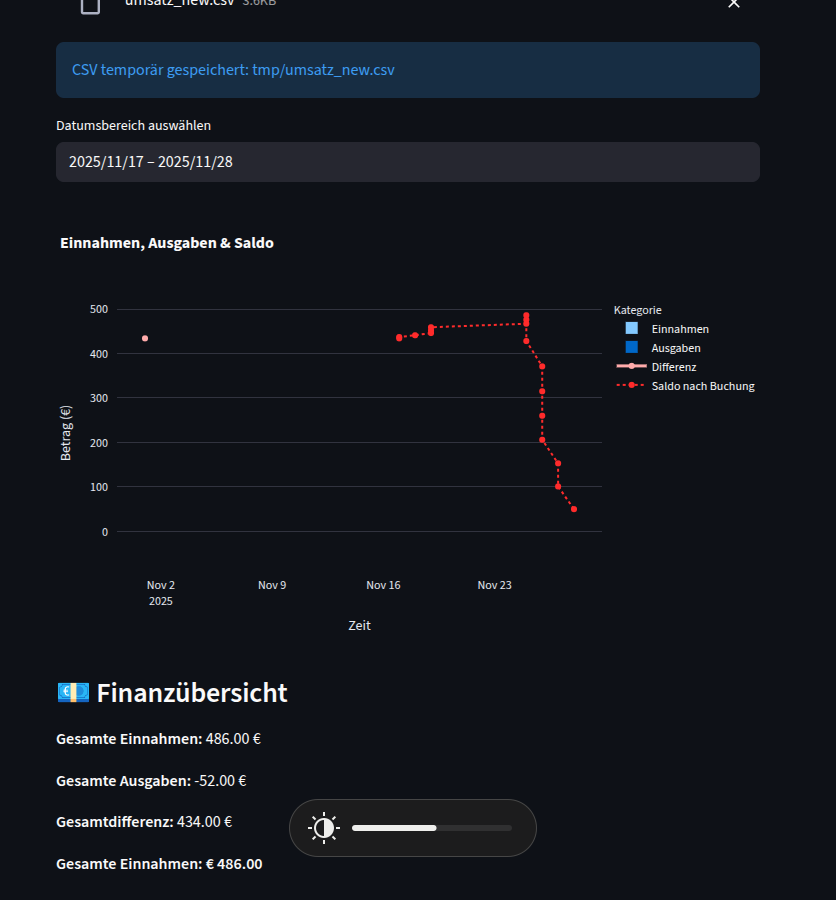
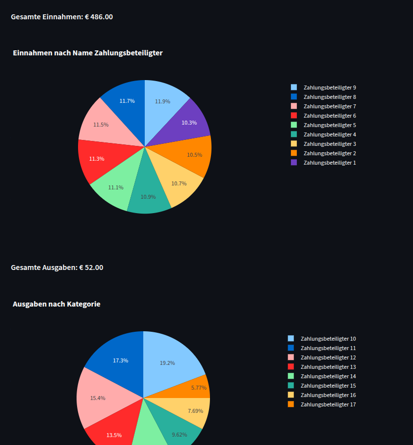

# CSV umsatzplotter - Dashboard

Ein kleines, modulares Streamlit-Dashboard zum Laden, Filtern und Visualisieren von CSV-Daten – optimiert für **Volksbank CSV-Exporte**. Der Fokus liegt auf einfacher Erweiterbarkeit und sauberer Trennung zwischen Loader, GUI und Plot-Modulen.




---

## Features

* **Automatisches Wiederladen** der zuletzt geöffneten CSV-Datei über `last_file.json`.
* **Kompatibel mit Volksbank CSV-Exporten** (Konto-Umsätze).
* CSV-Dateien werden sicher in `tmp/` abgelegt, um Streamlit-Uploads persistieren zu können.
* **Datumsbereich global auswählbar** .
* **Dynamische Plot-Module**: Alle `*.py` Dateien im Ordner `plots/` werden automatisch geladen.
* Zentrale `loader.py` in `src/`, um CSV einzulesen und den letzten Pfad zu speichern.

---

## Projektstruktur

```
project/
├── main.py          # Streamlit App
├── images/
│   ├── screenshot1.png
│   └── ...
├── src/
│   └── loader.py    # CSV-Loader + last_file Management
├── plots/
│   ├── piechart.py  # Beispielplot
│   ├── bars.py      # Beispielplot
│   └── ...
├── tmp/             # Temporäre Uploads (automatisch erstellt)
└── README.md
```

---

## Installation

```bash
pip install -r requirements.txt
```

---

## Starten

```bash
streamlit run main.py
```

---

## Funktionsweise

### 🔹 `loader.py` (unter `src/`)

* Verantwortlich für:

  * CSV laden (Volksbank-kompatibel)
  * temporäre Speicherpfade verwalten
  * letzte geladene Datei persistent speichern

Durch das Zwischenspeichern in `tmp/` können auch Streamlit-Dateiuploads erneut geladen werden.

---

## Erweiterbarkeit

Neue Plots können einfach hinzugefügt werden:

1. Neue Datei z. B. `plots/myplot.py`
2. Funktion anlegen:

   ```python
   def plot(df):
       ...
   ```
3. Wird automatisch im Dashboard angezeigt.

---
4. TODO
Fix date selection 
add better category organizer

## License

MIT
